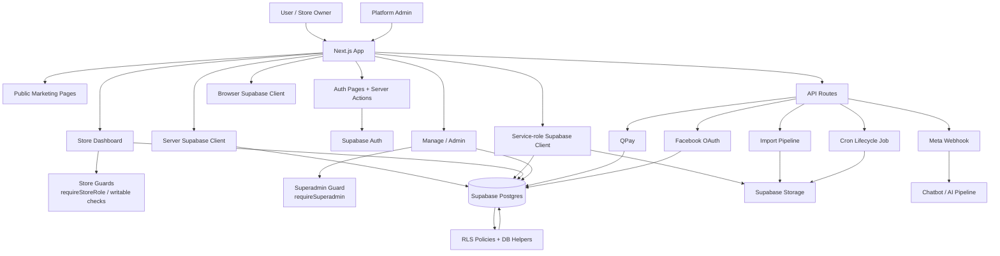

# Index

## Project Summary

This project is a Next.js 16 + Supabase application for an AI chat agent for online stores. The product combines:
- a public marketing site
- Supabase-backed auth and store membership
- a store dashboard for products, conversations, billing, and settings
- admin / management pages for platform operators
- API routes for Meta Messenger webhooks, Facebook OAuth, QPay callbacks, cron lifecycle jobs, and import processing

The current documentation set is focused on six areas:
- [[AI-Assistant-for-Onlineshop-Overview]] for the high-level project structure
- [[AI-Assistant-for-Onlineshop-Design-Guidelines]] for dashboard UI density, shadcn usage, and minimal product-surface rules
- [[AI-Assistant-for-Onlineshop-Workflows]] for key runtime flows and operational sequences
- `[[AI-Assistant-for-Onlineshop-Routes-Map]]` for route-by-route navigation
- `[[AI-Assistant-for-Onlineshop-Auth-and-Supabase]]` for session, roles, and RLS
- `[[AI-Assistant-for-Onlineshop-API-and-Webhooks]]` for endpoint and integration behavior

## Links To All Notes

- [[AI-Assistant-for-Onlineshop-Overview]]
- [[AI-Assistant-for-Onlineshop-Design-Guidelines]]
- [[AI-Assistant-for-Onlineshop-Workflows]]
- [[AI-Assistant-for-Onlineshop-Routes-Map]]
- [[AI-Assistant-for-Onlineshop-Auth-and-Supabase]]
- [[AI-Assistant-for-Onlineshop-API-and-Webhooks]]

## Suggested Reading Order

1. [[AI-Assistant-for-Onlineshop-Overview]] - start here to understand the project shape and main folders.
2. [[AI-Assistant-for-Onlineshop-Design-Guidelines]] - read this before changing dashboard or shadcn UI surfaces.
3. `[[AI-Assistant-for-Onlineshop-Workflows]]` - read next to see the key runtime flows end to end.
4. `[[AI-Assistant-for-Onlineshop-Auth-and-Supabase]]` - read next to understand identity, session handling, and database access boundaries.
5. `[[AI-Assistant-for-Onlineshop-Routes-Map]]` - use this to map the app surface area and route responsibilities.
6. `[[AI-Assistant-for-Onlineshop-API-and-Webhooks]]` - finish here for endpoint-specific behavior, integrations, and operational risks.

## Architecture Diagram

## Current Biggest Risks

- Service-role usage is the main privilege boundary. `createAdminClient()` bypasses RLS, so any misuse could expose or mutate tenant data incorrectly.
- Multiple paths rely on app-level guards in addition to RLS. If a new route or action skips `requireStoreRole()` or `requireSuperadmin()`, the database alone may not block the wrong operation.
- Webhook and callback endpoints depend on exact upstream contracts: Meta signatures, OAuth state/session matching, and QPay invoice validation.
- Import processing accepts uploaded spreadsheets and can do long-running writes. That creates operational and denial-of-service risk if validation or limits regress.
- Some pieces are still undocumented or not directly inspected, especially `services/*` and a few route/action files. Those are the likely places for hidden coupling.

## Recommended Next Documentation Tasks

- Document `services/meta/*` and `services/qpay/*` so the external contract boundaries are explicit.
- Document `src/lib/import/xlsx.ts` and `src/lib/audit.ts` so the import and audit flows are understandable without reading code.
- Add a note for `dashboard/[storeId]/settings/*` and `manage/*` if you want a cleaner map of the page-level admin surfaces.
- Add a database schema note from `supabase/migrations/*` focused on tables, policies, and lifecycle functions.
- Add a deployment note for required environment variables and webhook callback URLs.
- Add an operational note for cron, webhook retries, and storage purge behavior.

